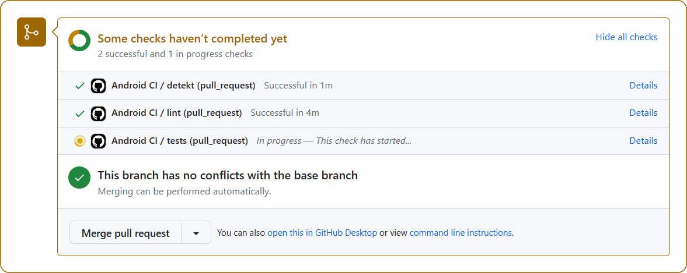
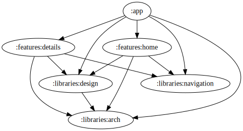
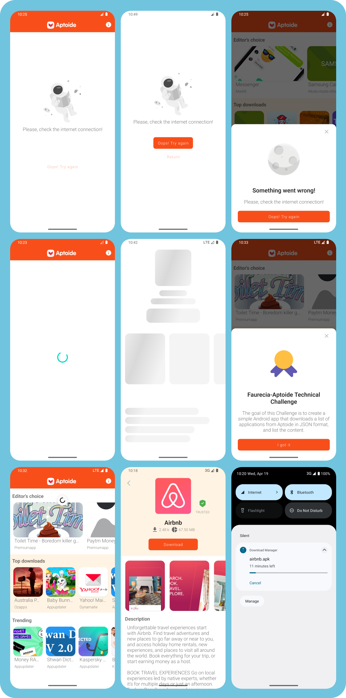
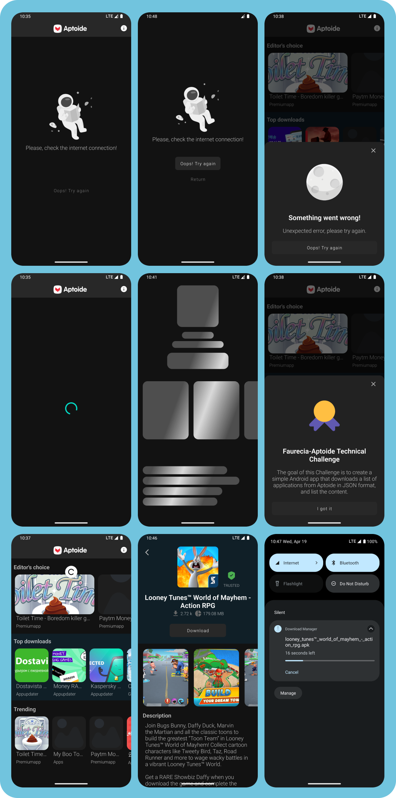

# Faurecia-aptoide-challenge

## Technical Description

This project was built with Android Studio Electric Eel | 2022.1.1. The project uses Clean Architecture and MVVM presentation pattern. RxJava is used for asynchronous calls and StateFlow and SharedFlow are used to ensure the screen state and emission of unique events.

The project is modularized into features such as Home and Details, and a Libraries module contains Arch, Design, and Navigation modules. Koin is used for dependency injection, and tests are included to ensure that all dependencies are provided at runtime.

The project includes unit tests for the domain and presentation layers, and integration tests for the data layer. The Design module contains the project's design system, while the Arch module contains helper classes to aid development. BuildSrc is used for dependency management, and shared gradles are stored in the Plugins folder.

Static analysis libraries such as Detekt and JaCoCO are included to ensure quality, and a workflow is set up to run automated tests on each pull request.

## Bonus Task

When click on any item from the main list, a new screen with information about this item should be shown. I used the following endpoint to open details screen and download the APK file: http://ws2.aptoide.com/api/7/app/getMeta/package_name=cm.aptoide.pt

## API Endpoint

The JSON information is obtained from the following URL: http://ws2.aptoide.com/api/6/bulkRequest/api_list/listApps

## Minimum SDK Version

The minimum SDK version required is 28.

## Encouraged Libraries

The use of the following libraries is encouraged:

- Retrofit2
- RxJava
- Material Design
- MVVM or MVP

## This project involves the use of:

* [Koin dependency injection](https://insert-koin.io/)

* [RxJava](https://github.com/ReactiveX/RxJava)

* [RxAndroid](https://github.com/ReactiveX/RxAndroid)

* [MVVM - presentation pattern](https://en.wikipedia.org/wiki/Model%E2%80%93view%E2%80%93viewmodel)

* [Clean architecture](https://blog.cleancoder.com/uncle-bob/2012/08/13/the-clean-architecture.html)

* [StateFlow for View states](https://developer.android.com/kotlin/flow/stateflow-and-sharedflow#stateflow)

* [SharedFlow for View actions](https://developer.android.com/kotlin/flow/stateflow-and-sharedflow#sharedflow)

* [ListAdapter - Generic adapter](https://medium.com/@costa.fbo/reduce-boilerplate-code-with-a-single-listadapter-for-multiple-recyclerviews-c7d657917c66)

* [DiffUtil](https://developer.android.com/reference/androidx/recyclerview/widget/DiffUtil)

* [ViewBinding](https://developer.android.com/topic/libraries/view-binding)

* [Lifecycle](https://developer.android.com/guide/components/activities/activity-lifecycle)

* [Retrofit](https://github.com/square/retrofit)

* [Coil](https://github.com/coil-kt/coil)

* [DownloadManager](https://developer.android.com/reference/android/app/DownloadManager)

## Unit tests, integration tests and instrumentation tests with

* [Espresso](https://developer.android.com/training/testing/espresso)

* [Mockk](https://mockk.io/ANDROID.html)

* [Robot Pattern](https://jakewharton.com/testing-robots/)

## Quality

* [Detekt](https://detekt.dev/)

* [JaCoCo](https://en.wikipedia.org/wiki/Java_code_coverage_tools)

* [GitHub Actions](https://github.com/features/actions)
  

## Module dependencies

* [Modularization](https://developer.android.com/topic/modularization)

## Screens

## Credits

This challenge was created by [Faurecia-Aptoide](https://faurecia-aptoide.com/).
